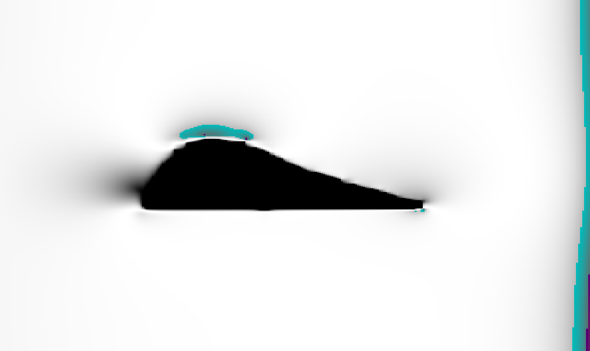
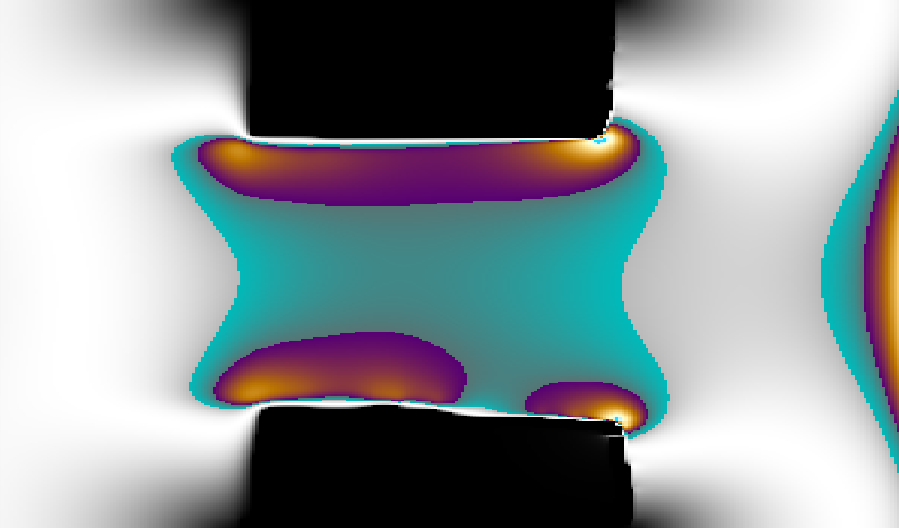

# Fluid simulation using LBM

A Python script for simulating fluid dynamics in 2D using **Lattice Boltzmann method** on GPU with **CUDA** library.

### Fluid flow around the wing profile

> Colormap in increasing order: Black, White, Cyan, Purple, Orange...

### Fluid flow after narrowing the tunnel
